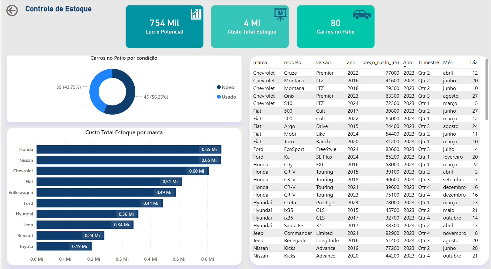

# Dashboard de Performance e Análise Estratégica - Brasil Motors 🚗💨

## 📝 Sobre o Projeto
Este projeto de Business Intelligence foi desenvolvido para a **Brasil Motors** com o objetivo de analisar métricas de vendas e entender fatores de mercado que influenciam a tomada de decisão no setor automotivo, incluindo a influência dos preços de combustível e energia na compra de veículos. 

O foco principal foi construir uma solução analítica de ponta a ponta: desde a extração e limpeza rigorosa dos dados até a construção de uma interface de usuário (UI/UX) limpa, intuitiva e com navegação fluida, semelhante a um aplicativo corporativo.

## 🚀 Estrutura e Funcionalidades
O dashboard foi arquitetado com um menu de navegação lateral em três visões principais, garantindo que a análise siga uma narrativa lógica:

*   **Página Inicial (Visão Gerencial):** Acompanhamento de KPIs vitais como Unidades Vendidas (300), Faturamento Total (R$ 219 Mi) e Ticket Médio. Inclui a evolução histórica do faturamento, ranking de performance por vendedor e distribuição por forma de pagamento.
*   **Mapa de Vendas (Distribuição Geográfica):** Análise espacial destacando os estados com maior volume de negócios, complementada por um detalhamento profundo do faturamento por montadora (Jeep, Toyota, Volkswagen, etc.) e segmentação de mercado.
*   **Controle de Estoque (Inventário):** Gestão estratégica do pátio, monitorando o Lucro Potencial, Custo Total de Estoque e a proporção de veículos novos contra usados, além de uma matriz detalhada para auditoria rápida de cada unidade.

## 🛠 Tecnologias e Técnicas Aplicadas
Para garantir a performance e a escalabilidade deste projeto, as seguintes ferramentas foram utilizadas:

*   **Power BI:** Desenvolvimento visual, modelagem de dados (Star Schema) e criação de medidas complexas com DAX. Implementação de navegação por botões (Bookmarks/Ações) para otimizar o layout.
*   **Python & Power Query:** Utilizados nas etapas de ETL (Extração, Transformação e Carga) para garantir um alto padrão de limpeza e qualidade dos dados antes de chegarem ao modelo visual.
*   **SQL:** Estruturação e consulta de banco de dados relacional para alimentar as tabelas de fatos e dimensões.
*   **Design de UI/UX:** Aplicação de conceitos de design profissional inspirados no Figma, utilizando paletas de cores consistentes, alinhamento simétrico, "white text boxes" para contraste e ícones minimalistas para reduzir a carga cognitiva do usuário final.

## 📊 Visualização do Dashboard

Abaixo, as capturas de tela demonstrando a interface final e a interatividade da ferramenta:

| Visão Gerencial | Mapa de Vendas | Controle de Estoque |
| :---: | :---: | :---: |
|  |  |  |

---
*Desenvolvido com foco em transformar dados complexos em decisões estratégicas.*
