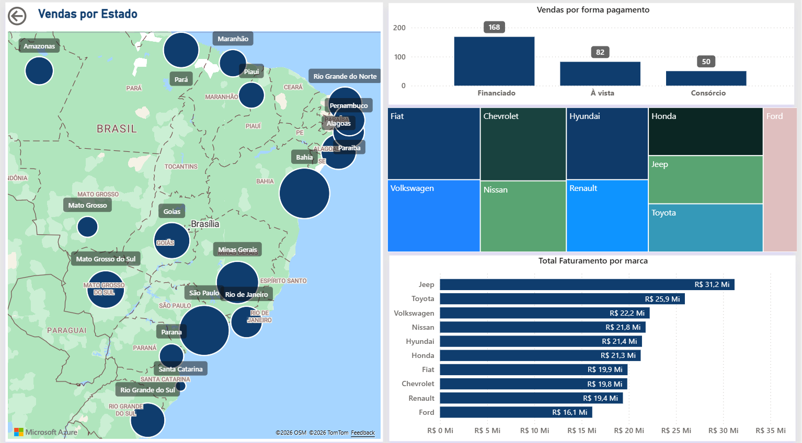

# Dashboard de Performance e Análise Estratégica - Brasil Motors 🚗💨

## 📝 Sobre o Projeto
Este projeto de Business Intelligence foi desenvolvido para a **Brasil Motors**, uma loja de veículos, com o objetivo de analisar detalhadamente o desempenho comercial do negócio e facilitar a tomada de decisão estratégica. 

O foco central da solução é transformar dados brutos em insights claros sobre as vendas, avaliando a performance individual dos vendedores, o giro das marcas, a distribuição das vendas em diferentes regiões do país e as preferências de forma de pagamento dos clientes.

## 🚀 Estrutura e Funcionalidades
O dashboard foi arquitetado com um menu de navegação lateral em três visões principais, garantindo que a análise siga uma narrativa lógica e direta:

*   **Página Inicial (Performance de Vendas):** Acompanhamento de KPIs vitais como Unidades Vendidas (300), Faturamento Total (R$ 219 Mi) e Ticket Médio. Inclui a evolução histórica do faturamento, um ranking de desempenho detalhado por vendedor e a distribuição percentual por forma de pagamento (Financiado, À vista e Consórcio).
*   **Mapa de Vendas (Distribuição Geográfica e Marcas):** Análise espacial destacando os estados com maior volume de negócios, complementada por um detalhamento profundo do faturamento e volume de vendas segmentado por montadora (Jeep, Toyota, Volkswagen, etc.).
*   **Controle de Estoque (Inventário):** Gestão estratégica do pátio de veículos, monitorando o Lucro Potencial, Custo Total de Estoque e a proporção de carros novos contra usados, além de uma matriz detalhada para auditoria de cada unidade disponível.

## 🛠 Tecnologias e Técnicas Aplicadas
Para garantir a performance, integridade dos dados e uma excelente experiência de uso, o projeto utilizou as seguintes ferramentas:

*   **Power BI:** Desenvolvimento visual, modelagem de dados e criação de métricas utilizando DAX. Implementação de navegação por botões (Bookmarks/Ações) para criar uma interface no estilo de aplicativo.
*   **Python:** Utilizado na etapa de tratamento preliminar e limpeza dos dados, garantindo consistência nas informações de vendas e cadastros.
*   **SQL:** Estruturação e consulta de banco de dados para alimentar as tabelas do dashboard.
*   **Design de UI/UX:** Aplicação de conceitos de design profissional, utilizando paleta de cores corporativa, alinhamento consistente, agrupamento visual e ícones minimalistas para tornar a leitura dos dados mais fluida.

## 📊 Visualização do Dashboard

Abaixo, as capturas de tela demonstrando a interface final e as visões de análise:

| Visão de Vendedores | Mapa e Marcas | Controle de Estoque |
| :---: | :---: | :---: |
|  |  |  |

---
*Transformando dados automotivos em inteligência de negócios.*
